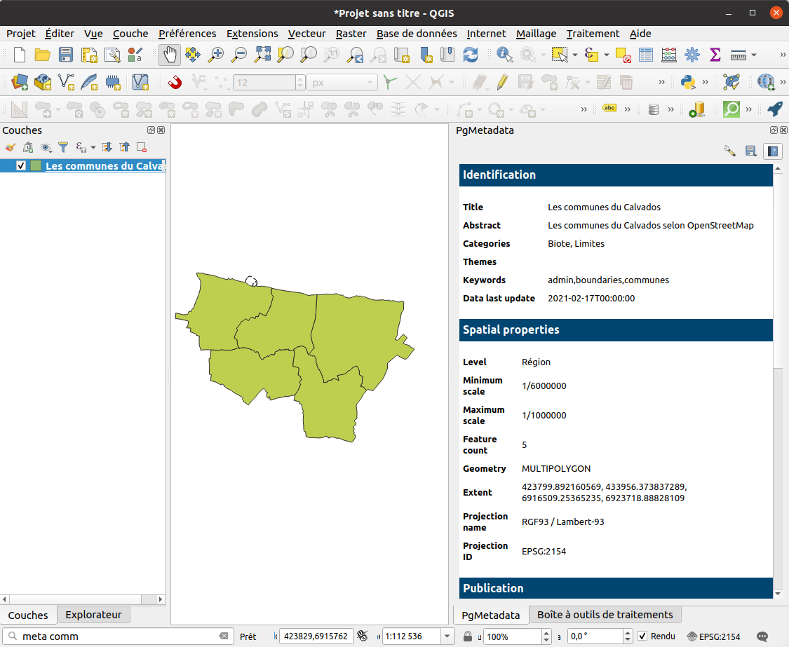

---
hide:
  - navigation
  - toc
---

# PgMetadata

## Short introduction

It's a QGIS plugin to store some metadata for PostgreSQL layers inside a PostgreSQL database 🐘.

Metadata for a PostgreSQL table includes :

* a title
* an abstract
* keywords  
* categories and themes  
* spatial properties such as extent, feature count, projection, scales
* 0 or many contacts with a role  
* 0 or many links
* …

Some key features for final users :

* a [locator](./user-guide/end-user.md#locator) to easy search and add layers
* a [dock](./user-guide/end-user.md#panel) to display metadata
* Export a [single](./user-guide/end-user.md#export-a-single-metadata) sheet to PDF, HTML DCAT
* Export the full [catalog](./user-guide/end-user.md#export-the-catalog)

Some features for the GIS administrator :

* [A QGIS project](./user-guide/gis-admin.md#administration-project) designed to manage the metadata.
  * Some views are included to detect some orphaned tables.
* [Customization](./user-guide/gis-admin.md#html-template) of the HTML template

To help, there are some [videos tutorials](./user-guide/tutorials.md).

## Description

**PgMetadata** is made for people using **QGIS** as their main GIS application, and **PostgreSQL** 🐘 as their main vector data storage.

The metadata of layers are stored inside your PostgreSQL database, in a dedicated schema. Classical fields are supported, such as the `title`, `description`, `categories`, `themes`, `links`, and the spatial properties of your data: `extent`, `projection`, etc.

PgMetadata is not designed as a catalog application which lets you search among datasets and then download the data. It is designed to **ease the use of the metadata inside QGIS**, allowing to search for a data and open the corresponding layer, or to view the metadata of the already loaded PostgreSQL layers.

By storing the metadata of the vector tables inside the database:

* QGIS can read the metadata easily by using the layer PostgreSQL connection: a [dock](./user-guide/end-user.md#panel) shows the metadata for the active layer when the plugin detects metadata exists for this QGIS layer.
* QGIS can run SQL queries: you can use the [QGIS locator search bar](./user-guide/end-user.md#locator) to search for a layer, and load it easily in your project.

The **administrator** in charge of editing the metadata will also benefit from the PostgreSQL storage:

* PostgreSQL/PostGIS functions are used to automatically update some fields based on the table data (the layer extent, geometry type, feature count, projection, etc.).
* The metadata is saved with your data anytime you backup the database.
* You do not need to share XML files across the network or install a new catalog application to manage your metadata and allow the users to get it. Only PostgreSQL is needed.

The plugin contains some [processing algorithms](./processing/) to help the administrator. For example:

* a script helps to [create or update](./processing/#database) the needed `pgmetadata` PostgreSQL schema and tables in your database.
* a algorithm [creates a QGIS project](./processing/#create-metadata-administration-project) suitable for the metadata editing. This project uses the power of QGIS to create a rich user interface allowing to edit your metadata easily (forms, relations). Why use another interface when QGIS rocks ?

More PgMetadata features:

* [Modification of the HTML template](./user-guide/gis-admin.md#html-template) to tune the displayed metadata
* [Export a metadata sheet](./user-guide/end-user.md#export-a-single-metadata) to PDF, HTML or DCAT
* Publish the metadata as a DCAT catalog with the [Lizmap Web Client module for PgMetadata](https://docs.3liz.org/qgis-pgmetadata-plugin/). It can then be harvested by external applications (Geonetwork, CKAN)
* The data model is very close to the QGIS metadata storage and the DCAT vocabulary for compatibility.
