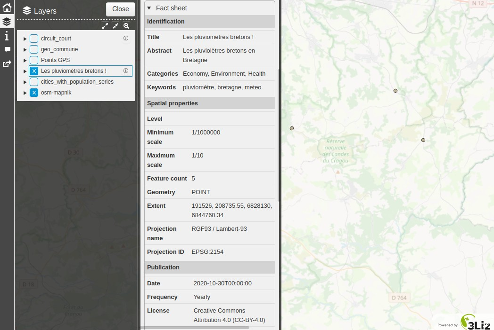

# Lizmap Web Client

The metadata can be displayed in the QGIS Lizmap Web Client using the
[PgMetadata module](https://github.com/3liz/lizmap-pgmetadata-module).

The module is also providing a DCAT catalog to be harvested.

