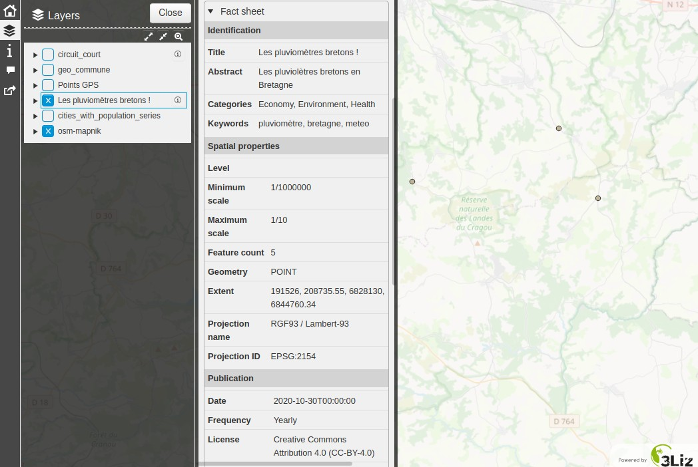

---
hide:
  - navigation
---

# Lizmap Web Client

The metadata can be displayed in the QGIS [Lizmap Web Client](https://github.com/3liz/lizmap-web-client/)
using the [PgMetadata module](https://github.com/3liz/lizmap-pgmetadata-module).

The module is also providing a [DCAT](https://en.wikipedia.org/wiki/Data_Catalog_Vocabulary) catalog, ready to
be harvested 🚀.

