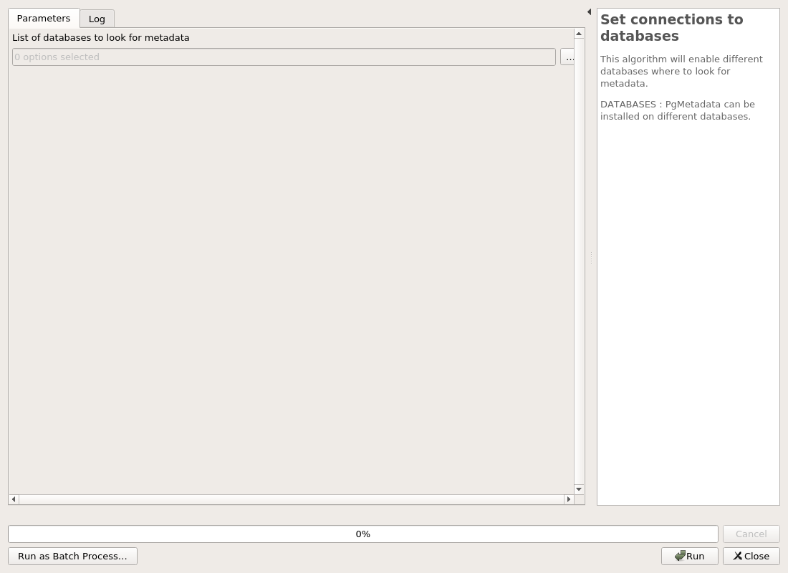
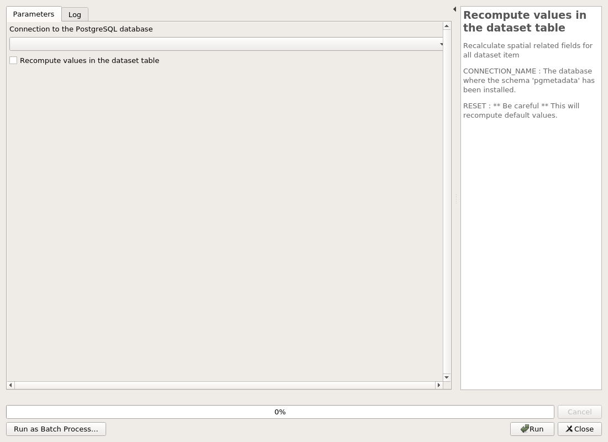
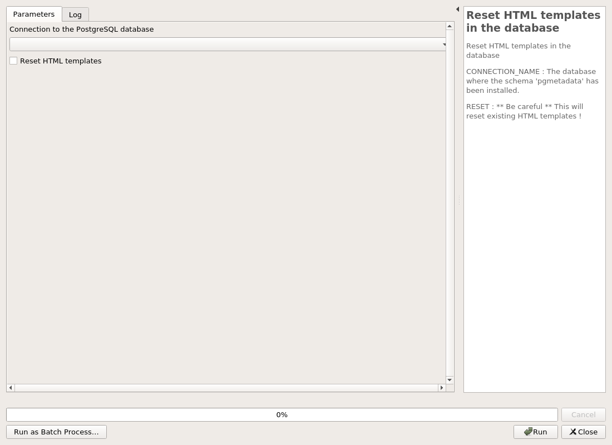

---
hide:
  - navigation
---

# Processing

## Administration

### Create metadata administration project

This algorithm will create a new QGIS project file for PgMetadata administration purpose.

The generated QGIS project must then be opened by the administrator to create the needed metadata by using QGIS editing capabilities.

CONNECTION_NAME : The database where the schema 'pgmetadata' is installed.

PROJECT_FILE : The destination file where to create the QGIS project.

#### Parameters

| ID | Description | Type | Info | Required | Advanced | Option |
|:-:|:-:|:-:|:-:|:-:|:-:|:-:|
CONNECTION_NAME|Connection to the PostgreSQL database|String|The database where the schema 'pgmetadata' is installed.|✓|||
PROJECT_FILE|QGIS project file to create|FileDestination|The destination file where to create the QGIS project.|✓|||

#### Outputs

| ID | Description | Type | Info |
|:-:|:-:|:-:|:-:|
PROJECT_FILE|QGIS project file to create|File||

***

### Set connections to databases

This algorithm will enable different databases where to look for metadata.

DATABASES : PgMetadata can be installed on different databases.

#### Parameters

| ID | Description | Type | Info | Required | Advanced | Option |
|:-:|:-:|:-:|:-:|:-:|:-:|:-:|
DATABASES|List of databases to look for metadata|Enum|PgMetadata can be installed on different databases.|✓||Values:   |

#### Outputs

| ID | Description | Type | Info |
|:-:|:-:|:-:|:-:|
No output

***

## Database

### Installation of the database structure

When you are running the plugin for the first time on a new database, you need to install the database schema.

It will erase and/or create the schema 'pgmetadata'.

CONNECTION_NAME : The database where the schema 'pgmetadata' will be installed.

OVERRIDE : ** Be careful ** This will remove data in the schema !

#### Parameters

| ID | Description | Type | Info | Required | Advanced | Option |
|:-:|:-:|:-:|:-:|:-:|:-:|:-:|
CONNECTION_NAME|Connection to the PostgreSQL database|String|The database where the schema 'pgmetadata' will be installed.|✓|||
OVERRIDE|Erase the schema pgmetadata ?|Boolean|** Be careful ** This will remove data in the schema !|✓|||

#### Outputs

| ID | Description | Type | Info |
|:-:|:-:|:-:|:-:|
DATABASE_VERSION|Database version|String||

***

### Recompute values in the dataset table

Recalculate spatial related fields for all dataset item

CONNECTION_NAME : The database where the schema 'pgmetadata' has been installed.

RESET : ** Be careful ** This will recompute default values.

#### Parameters

| ID | Description | Type | Info | Required | Advanced | Option |
|:-:|:-:|:-:|:-:|:-:|:-:|:-:|
CONNECTION_NAME|Connection to the PostgreSQL database|String|The database where the schema 'pgmetadata' has been installed.|✓|||
RESET|Recompute values in the dataset table|Boolean|** Be careful ** This will recompute default values.|✓|||

#### Outputs

| ID | Description | Type | Info |
|:-:|:-:|:-:|:-:|
No output

***

### Reset HTML templates in the database

Reset HTML templates in the database

CONNECTION_NAME : The database where the schema 'pgmetadata' has been installed.

RESET : ** Be careful ** This will reset existing HTML templates !

#### Parameters

| ID | Description | Type | Info | Required | Advanced | Option |
|:-:|:-:|:-:|:-:|:-:|:-:|:-:|
CONNECTION_NAME|Connection to the PostgreSQL database|String|The database where the schema 'pgmetadata' has been installed.|✓|||
RESET|Reset HTML templates|Boolean|** Be careful ** This will reset existing HTML templates !|✓|||

#### Outputs

| ID | Description | Type | Info |
|:-:|:-:|:-:|:-:|
No output

***

### Upgrade the database structure

When the plugin is upgraded, a database upgrade may be available as well. The database migration must be applied as well on the existing database.

CONNECTION_NAME : The database where the schema 'pgmetadata' is installed.

RUN_MIGRATIONS : For security reason, we ask that you explicitly use this checkbox.

#### Parameters

| ID | Description | Type | Info | Required | Advanced | Option |
|:-:|:-:|:-:|:-:|:-:|:-:|:-:|
CONNECTION_NAME|Connection to the PostgreSQL database|String|The database where the schema 'pgmetadata' is installed.|✓|||
RUN_MIGRATIONS|Use this checkbox to upgrade.|Boolean|For security reason, we ask that you explicitly use this checkbox.|✓|||

#### Outputs

| ID | Description | Type | Info |
|:-:|:-:|:-:|:-:|
DATABASE_VERSION|Database version|String||

***

