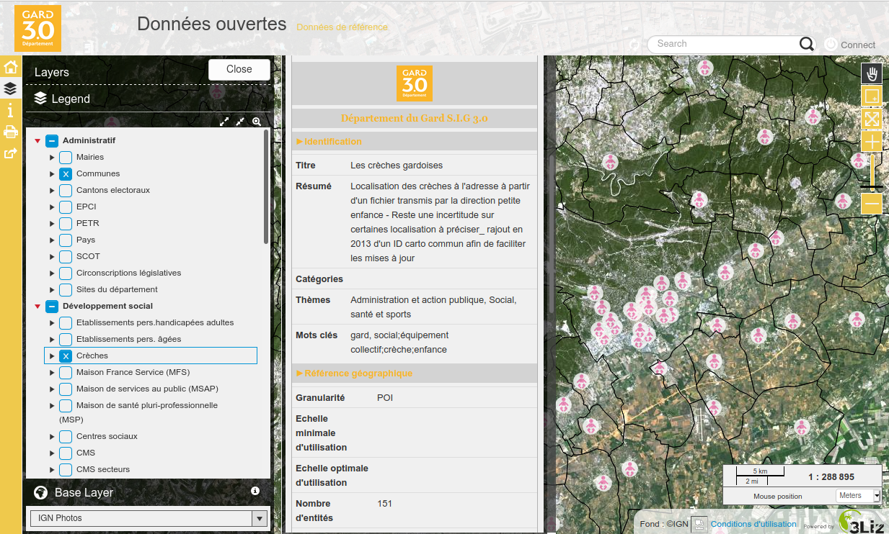

---
hide:
  - navigation
---

# References

## Exemple

### Gard province in France

The French Gard province is using this project on
[their Lizmap Web Client](https://sig.gard.fr/index.php/view/map/?repository=commun&project=A_Dns_ouvertes_2019)
instance to display the metadata, and the catalog is harvested by the French Open Data portal
[data.gouv.fr](https://www.data.gouv.fr).

As a consequence, the province has its
[own page](https://www.data.gouv.fr/fr/organizations/departement-du-gard/) on the national portal showing the
same metadata.

!!! quote "Lydia Courret, administratrice SIG au département du Gard, in French 🇫🇷"
    Le Département du Gard disposait en interne d’un recensement des métadonnées de l’ensemble des couches
    vecteurs de la base PostgreSQL sur Excel. En externe, une trentaine de couches étaient cataloguées sur la
    plateforme régionale d’OpenIG. Dans le portail de cartes Lizmap du département (https://sig.gard.fr/),
    certaines informations liées aux métadonnées étaient saisies et publiées dans la description de chacune
    des couches. Il n’y avait pas de liens entre ces différentes briques. L’enjeu était de proposer un
    catalogue interopérable entre les différentes briques de la plateforme au département du Gard : 
    Postgres / QGIS / Lizmap en évitant les doubles saisies de métadonnées : un catalogue accessible depuis
    QGIS pour les agents départementaux, accessible depuis les cartes dynamiques Lizmap et moissonnable. 

    3Liz par l’intermédiaire du développement d’une extension, PgMetadata, a répondu aux attentes du 
    Département du Gard.

    * Pour l’administrateur SIG, cette extension permet de stocker toutes les métadonnées des couches vecteurs
      dans 4 tables postgres. Un simple projet d’administration QGIS permet via des formulaires une saisie
      facilitée des métadonnées, une partie des champs étant alimentée automatiquement.

    * Les utilisateurs de QGIS quant à eux, trouvent et chargent une donnée dans leurs projets en saisissant
      un simple mot clé dans le gestionnaire de source de données postgreSQL ou via le Locator de QGIS. Un
      panneau de métadonnées est visible pour chacune des couches intégrées au projet. Cette recherche et 
      cette consultation des métadonnées s’intègrent parfaitement au projet QGIS et permettent aux
      utilisateurs de prendre connaissance des caractéristiques de chaque couche chargée dans le projet. 

    Ces mêmes fiches de métadonnées sont consultables également sur le portail de cartes web du département.
    Ainsi, les citoyens accèdent aussi à ces fiches.

    Enfin, l’objectif est d’intégrer ces métadonnées pour les données ouvertes sur le portail de la région
    OPenIG via un export DCAT.

    Cette extension PgMetadata a l’avantage d’être simple d’utilisation que ce soit pour les administrateurs,
    les utilisateurs de QGIS. Elle permet d’ouvrir les métadonnées sur l’extérieur via le portail de cartes
    dynamiques ou via des plateformes dédiées à l’ouverture des geodatas et des métadonnées attenantes. 

    Cette extension PgMetadata est donc avant tout au service des administrateurs et des utilisateurs de QGIS
    et de par la publication des fiches de métadonnées sur l’extérieur au service des citoyens.

Thanks to the [French Gard province](https://www.gard.fr) for funding this project.

## Conference

### QGIS-French day

A presentation in French at the [QGIS-Day](http://conf.qgis.osgeo.fr/) in December 2020 :

<iframe width="800" height="450" src="https://www.youtube.com/embed/o47w7zf40nw" frameborder="0" allow="accelerometer; autoplay; clipboard-write; encrypted-media; gyroscope; picture-in-picture" allowfullscreen></iframe>
