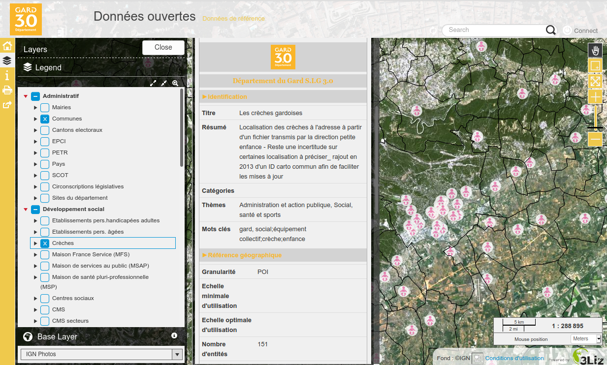

---
hide:
  - navigation
---

# References

## Exemple

### Gard province in France

The French Gard province is using this project on
[their Lizmap Web Client](https://sig.gard.fr/index.php/view/map/?repository=commun&project=A_Dns_ouvertes_2019)
instance to display the metadata, and the catalog is harvested by the French Open Data portal
[data.gouv.fr](https://www.data.gouv.fr).

As a consequence, the province has its
[own page](https://www.data.gouv.fr/fr/organizations/departement-du-gard/) on the national portal showing the
same metadata.

Thanks to the [French Gard province](https://www.gard.fr) for funding this project.

## Conference

### QGIS-French day

A presentation in French at the [QGIS-Day](http://conf.qgis.osgeo.fr/) in December 2020 :

<iframe width="800" height="450" src="https://www.youtube.com/embed/o47w7zf40nw" frameborder="0" allow="accelerometer; autoplay; clipboard-write; encrypted-media; gyroscope; picture-in-picture" allowfullscreen></iframe>
