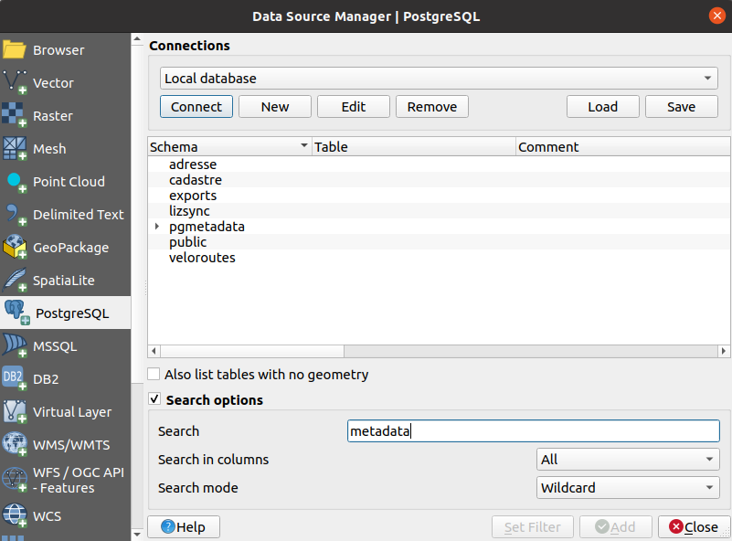

# For end users

## Locator

Type `ctrl+k` in QGIS to open the locator widget. You can start type `meta` then you should see layers in the
list.

## Datasource manager

This works without the plugin installed on the computer. It's native in QGIS.

## Panel

The PgMetadata panel can be opened. If set, the layer metadata will be displayed according to the layer 
selected in the legend.

## Export

To export metadata as PDF, HTML or DCAT, you need to select a layer in your layer tree saved in the metadata 
table `dataset`. Then in the dock you have a button to open the `export menu` and choose the output format.

If no layer with metadata are selected, you can't click on the button of the `export menu`.

