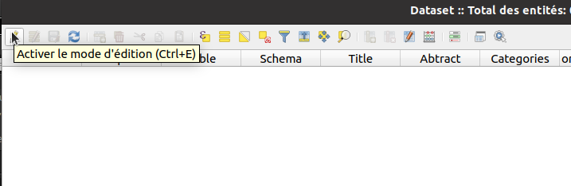
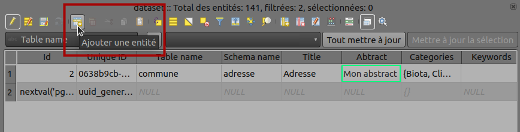
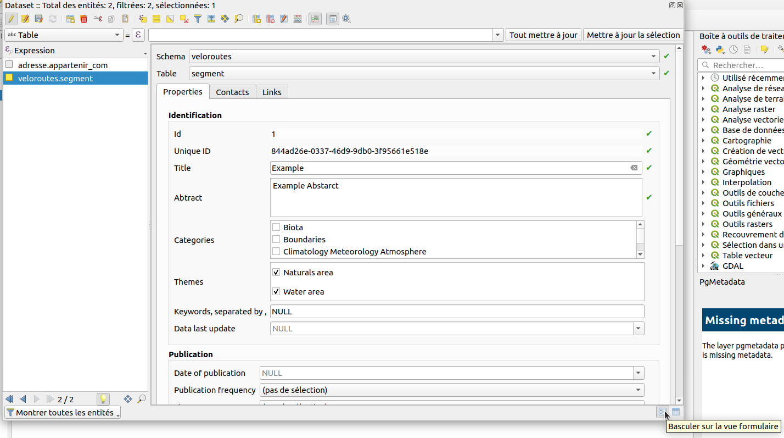
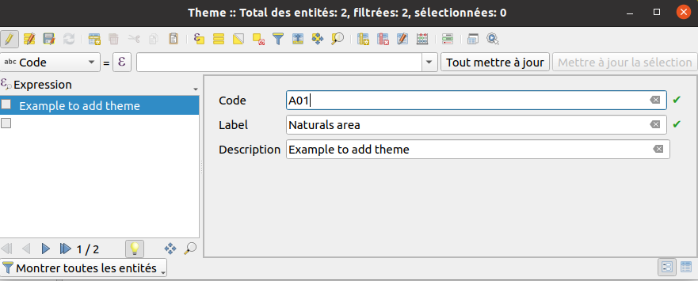
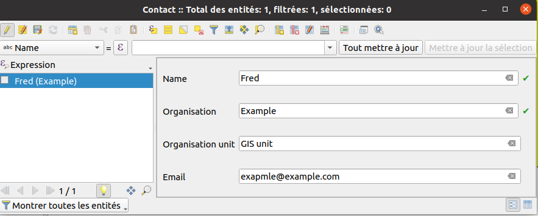
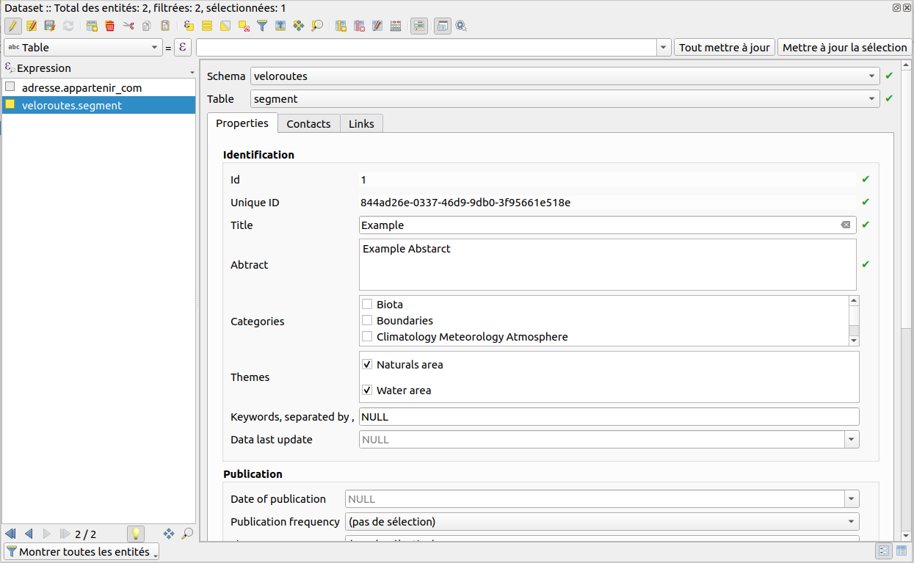
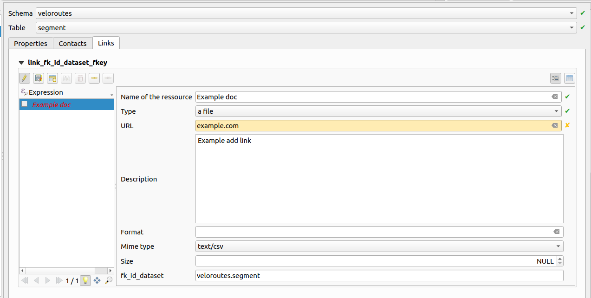
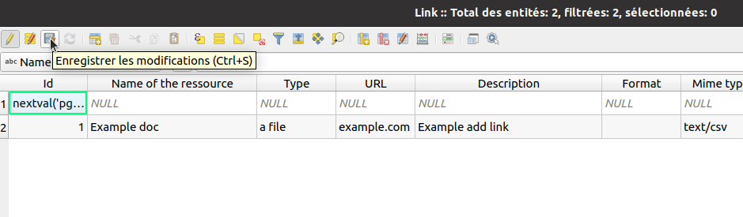

# For the GIS administrator

## Installation

### Database

1. The plugin is using a schema in PostgreSQL.
    * If you just installed the plugin in a new organization, you must use the 
      [install database structure](../processing/README.md#installation-of-the-database-structure)
    * If the `pgmetadata` schema is already existing in your database, you may need to upgrade it after a 
      plugin upgrade using the [upgrade database structure](../processing/README.md#upgrade-the-database-structure)

### Administration project

1. The GIS administrator can generate a QGIS project using 
[create metadata project](../processing/README.md#create-metadata-administration-project). You need to open
the generated project and use the normal QGIS editing tools.
1. In the group called `Information Warnings` :
    * `Orphan metadata` displays table not existing in the database itself, but the metadata exists in the 
      `dataset` table.
    * `Orphan tables` is the reverse. It displays tables existing in the database but in the `dataset` table.

## Editing metadata

Before creating metadata for your layer/table, you need to implement some table. To edit this table you need
to open the attribute table, switch on **Edition** mode and add a new row.

Switching to edit mode:

Adding a new row:

Switching to the form view: You can access the form view in the bottom right corner of the attribute table.

1. On the `Theme` table you can add many theme corresponding to different theme of your layers.
    You need to enter a **code** e.g. "A01", and a **label** corresponding at the name e.g. "Naturals area".
    Example adding theme:

    

1. On the `Contact` table you can add contacts that can later be associated with your metadata layer.
    Example new contact:

    

1. The `Dataset` table is the metadata table. You can add many rows and one added line corresponds to a 
   metadata of a layer.
    You need to fill a row with these minimum information : 
    * Table name,
    * Schema name,
    * Title,
    * Abstract,
    * Etc

    Example to add a new metadata for a layer:
      On the second picture you can see the theme.

    

1. Now you can add a contact to a dataset row with the `Dataset` table. You can click on a tab called `contact`.
    You need to allow **edit mode** in this tab because you implement another table.
    Example:

    

1. You can add some`Link` to a dataset row with the `Dataset` table. It's same that to add a contact,
   you have a link tab.
    Don't forget to allow **edit mode**.
    Example:

    

When you stop editing a table, don't forget to save your change with clicking on the save icon et leave the
edit mode.
To save:

To leave the edit mode you need to click on the same button that to enter the edit mode.

## HTML Template

You can customize the HTML template.

* Use `[% "name_of_field" %]` to display a specific field, eg `abstract`.
* use `[% meta_contacts %]` to display all contacts related. It's using the template called `contact`.
* use `[% meta_links %]` to display all links related. It's using the template called `link`.
